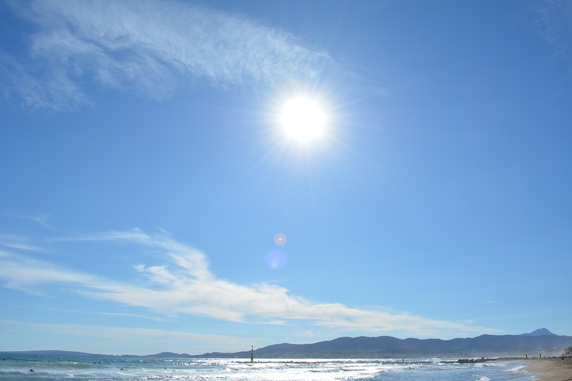

# Current : Science Challenge
---

### Question : _When is the sun tallest in the sky in New York?_

  
`photo credit : M-S-Night on ` [`pixabay`](https://pixabay.com/en/sun-summer-mountains-sky-clouds-1413721/)  

A. [The sun never moves so it is always at the same height](pink.md)  
B. [On the first day of summer](red.md)  