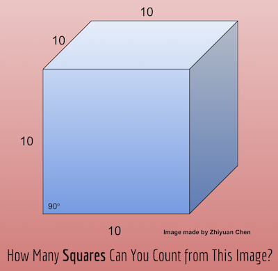

# Current : Math / Logic Challenge
---

### Look at the image and choose your answer  
    
`credit : image made by Zhiyuan`    

1. [1 Square](../endings/end4.md)  
2. [2 Squares](../endings/end4.md)  
3. [3 Squares](../endings/end7.md)  
4. [4 Squares](../endings/end7.md)  
5. [6 Squares](../endings/end3.md)  
6. [7 Squares](../endings/end3.md)  
