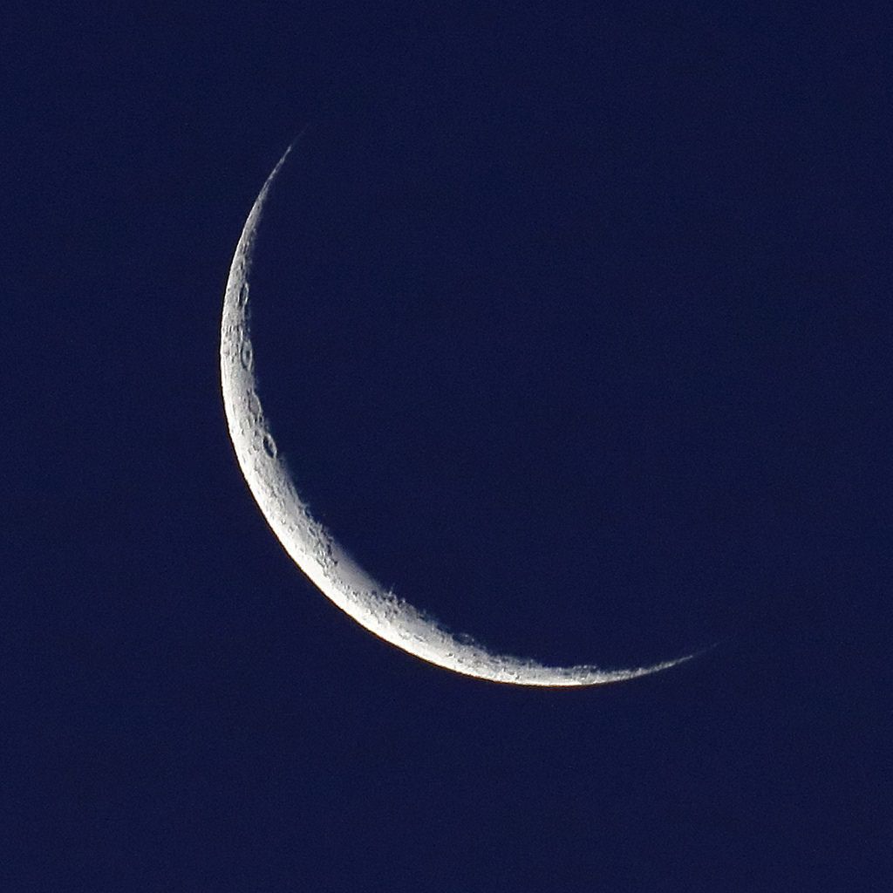

# Welcome to the Science Challenge  

---
### Question : _If there's a new moon every month. Where does the old one go?_

A. [The moon changes its phase](green.md)  
B. [Our moon was always old in the first place](blue.md)  